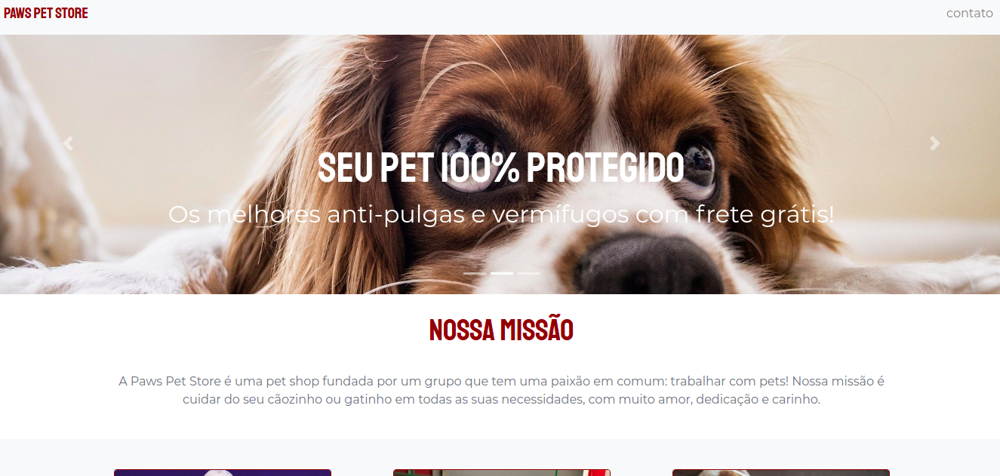

<h2 align="center"><a href="https://pawspetstore.netlify.app/">Paws Pet Store Landing Page </a></h2>
<h5 align="center">uma landing page para uma pet shop fictícia</h5>
<h1 align="center">
  
</h1>
---

## Technologies used:

  

## Services used

* [Github](https://github.com/)
* [Netfly](https://www.netlify.com/)

## Author

Build with :heart:! Get in touch!
[    Bianca Guzenski ](https://github.com/biancaguzenski) |
| :---: |  
 

